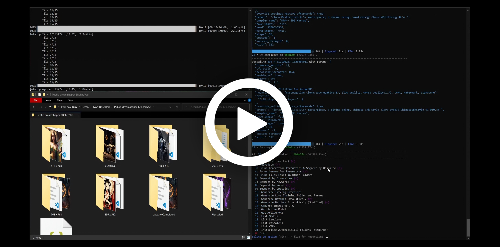

# SD Auto
Node.js-powered .bat script for automating Stable Diffusion bulk image generation and organization.

- Depends on the [Automatic1111 GUI](https://github.com/AUTOMATIC1111/stable-diffusion-webui) for core functionality (`--api` flag required).

- Optionally depends on the [Kohya SS GUI](https://github.com/bmaltais/kohya_ss) for training LORAs (Kohya has no API support at the moment).

- Supports the extensions [Dynamic Prompts](https://github.com/adieyal/sd-dynamic-prompts), [Tiled Diffusion & VAE](https://github.com/pkuliyi2015/multidiffusion-upscaler-for-automatic1111), and [Cutoff](https://github.com/hnmr293/sd-webui-cutoff).

- Used with [Windows Context Menu Manager](https://github.com/BluePointLilac/ContextMenuManager/blob/master/README-en.md) (as a `Background` item) to easily invoke the script from any directory containing images and/or generation parameters.

# Demo
")